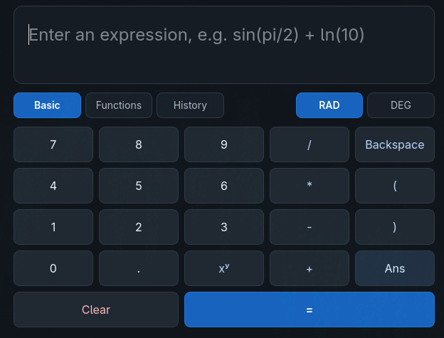

# Calculator

A compact desktop scientific calculator built with C++20 and Qt 6. It combines a keyboard-friendly interface with a parser-based calculation core, scientific functions, reusable results, and an in-memory calculation history.

## Features

- Basic arithmetic: addition, subtraction, multiplication, and division
- Exponentiation, parentheses, and unary negation
- Postfix factorial (`!`) and mathematical percentage (`x% = x / 100`)
- Scientific functions: `sqrt`, `sin`, `cos`, `tan`, `asin`, `acos`, `atan`, `abs`, `ln`, and `log10`
- Arbitrary-base logarithms with `log(base, value)`
- Radian and degree modes for trigonometric functions, including inverse-trigonometric results
- Mathematical constants `pi` and `e`
- `Ans` for reusing the last successful result
- Session calculation history with expression, result, and angle mode
- Source-positioned lexical, syntax, and evaluation diagnostics
- Basic and Functions modes with a shared keypad and categorized scientific controls
- Full expression entry from the physical keyboard

## Screenshot



## Architecture

Expressions are processed through a small, testable pipeline:

```text
Lexer -> Parser -> AST -> Evaluator
```

The parser and evaluator live in the Qt-independent `CalculatorCore` library. The Qt Widgets interface is built separately in `CalculatorUi` and provides session state such as `Ans`, angle mode, and calculation history.

## Requirements

- CMake 3.21 or newer
- A C++20-compatible compiler
- Qt 6 with the Widgets and Test components
- Catch2 3

All dependencies must be discoverable by CMake. If Qt or Catch2 is installed in a non-standard prefix, provide the appropriate CMake search path when configuring.

## Building

From a clean checkout:

```sh
cmake -S . -B build
cmake --build build
```

## Running

For a single-config build, run:

```sh
./build/Calculator
```

Multi-config generators may place the executable in a configuration subdirectory such as `build/Debug` or `build/Release`.

## Releases

Ready-to-run builds are available from the
[latest GitHub Release](https://github.com/Franek2009/Calculator/releases/latest).

### Windows x86-64

Download the Windows x86-64 `.zip` archive, extract it, and run
`bin/Calculator.exe`. The executable is not code-signed, so Windows may display
a SmartScreen warning.

### Linux x86-64

Download the Linux x86-64 Ubuntu 24.04 `.tar.gz` archive, extract it, and run
`bin/Calculator`. This build targets Ubuntu 24.04 and compatible x86-64
systems; compatibility with every Linux distribution is not guaranteed.

The archive includes the required Qt runtime libraries and plugins, but it does
not bundle glibc, graphics drivers, or the complete Linux display stack. It also
does not provide desktop or package-manager integration.

`Calculator-Qt-sources-6.8.3.tar.gz` contains the corresponding Qt source code
provided for license compliance. It is not required to run Calculator.

## Tests

After building, run the complete Core and Qt UI test suite through CTest:

```sh
ctest --test-dir build --output-on-failure
```

The Qt UI tests are configured to use Qt's offscreen platform plugin.

## Keyboard shortcuts

| Shortcut | Action |
| --- | --- |
| Enter | Calculate the current expression |
| Escape | Clear the current expression |
| Ctrl+H | Show or hide calculation history |
| Ctrl+L | Clear the current expression |
| Ctrl+Shift+H | Clear calculation history |

Standard text-editing shortcuts supported by `QLineEdit` continue to work in the expression field.

## Current limitations

- Multiplication must be explicit: use `2*pi` or `2*Ans`, not `2pi` or `2Ans`.
- `Ans` and calculation history exist only for the current application session.
- Function and constant names are case-sensitive; the previous result is spelled `Ans`.
- User-defined variables and assignments are not supported.
- Percentage is context-free: `200+10%` evaluates to `200.1`, not `220`.

## Project status

The project is complete in its current scope. Version 1.0.0 has been released.

## License

This project is licensed under the MIT License. See the `LICENSE` file for details.
